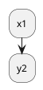

# PlantUML

## [Homepage](http://plantuml.com)

PlantUML is a component that allows to quickly write:  

- Sequence diagram
- Usecase diagram
- Class diagram
- Activity diagram (here is the legacy syntax)
- Component diagram
- State diagram
- Object diagram
- Deployment diagram
- Timing diagram

The following non-UML diagrams are also supported:  

- Wireframe graphical interface
- Archimate diagram
- Specification and Description Language (SDL)
- Ditaa diagram
- Gantt diagram
- Mathematic with AsciiMath or JLaTeXMath notation

## Extension in VSCode

Environment:
> Ubuntu 18.04.1, Linux 4.15.0-39-generic  
> PlantUML 2.9.9  
> plantuml.jar: PlantUML compiled Jar (Version 1.2018.12)  
> VSCode:
> - Version: 1.29.1
> - Commit: bc24f98b5f70467bc689abf41cc5550ca637088e
> - Date: 2018-11-15T19:07:43.495Z
> - Electron: 2.0.12
> - Chrome: 61.0.3163.100
> - Node.js: 8.9.3
> - V8: 6.1.534.41
> - Architecture: x64

Steps:  

1. Install extension _PlantUML_  
1. Download the integrated **PlantUML** jar [_plantuml.jar_](http://plantuml.com/download) into a permanent location (It's better in a monopolized folder).
    The latest version (>= V7947) enables the [**beta version**](http://plantuml.com/activity-diagram-beta) of _Activity Diagram_.
1. Set alternate plantuml.jar for the extension:  
    1. Open the VSCode's _Settings_ page:  
        - Select _File >> Preferences >> Settings_  
        - or Press `Ctrl + ,`  
    1. Select _Extensions_ & _PlantUML configurations_ in left section  
    1. Search following in right section:  
        ```text
        jar
            Alternate plantuml.jar location. Leave it blank to use integrated jar:
        ```
    1. Enter the path of _plantuml.jar_ downloaded in previous step  
1. Enjoy it !

## Embed PlantUML in Markdown & Preview Natively

[在VSCode使用Markdown绘制UML图](https://www.cnblogs.com/mainxx/p/9341876.html)

example code:

```markdown
### 在Markdown使用PlantUML

'''plantuml  //代码块标记为plantuml便于书写
    @startuml
    interface  ICollectBeganManagerFactory<T>{
    ..创建一个ICollectBegan..
    IDisposableDependencyObjectWrapper<ICollectBegan> Create(CollectTypes collectClassify);
    }
    note right:采集开始管理工厂接口
    interface IDisposableDependencyObjectWrapper{
        Object Object{get;}
    }
    note left of IDisposableDependencyObjectWrapper:ABP内置接口：对象包装器
    IDisposableDependencyObjectWrapper <.. ICollectBeganManagerFactory : 依赖
    class CollectBeganManagerFactory<T>
    ICollectBeganManagerFactory <|.. CollectBeganManagerFactory : 实现
    @enduml
'''

### 其它Marckdown

* test1
* test2
1. test1描述
2. test2描述
```

## Jekyll & Markdown & PlantUML

There are many means to embed PlantUML into a markdown document which is deployed on a Jekyll web server.

### Using the [Gravizo](http://www.gravizo.com/) image generation service

[UML diagrams for Jekyll and Markdown](http://www.dilek.me/uml/plantuml/markdown/2016/01/15/Uml-diagrams-in-Markdown-pages/)

```markdown
    ;
    ArrayList : Object[] elementData;
    ArrayList : size();
    @enduml
    )
```


### Embeding directly PlantUML Code

@startuml
:xx;
:ys;
@enduml

### Nest PlantUML code in a _plantuml_ environment

